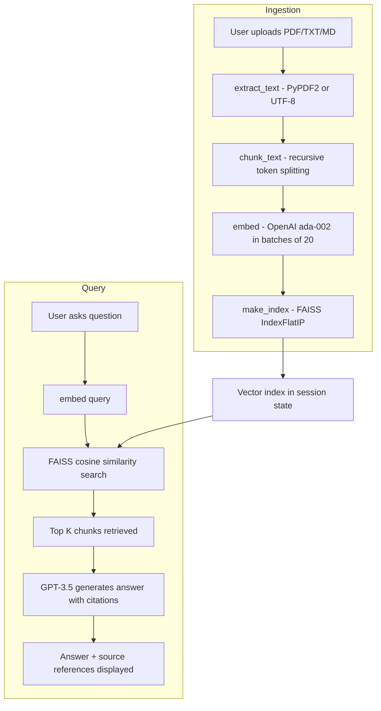

# RAG Q&A

I wanted to understand how RAG actually works under the hood so I built this from scratch. No LangChain, no abstractions. Just the OpenAI SDK, FAISS for vector search, and Streamlit for the UI.

Upload any PDF, TXT, or MD file. Ask questions. Get answers with citations pointing back to the exact chunk the answer came from.

## architecture



## what it does

Takes your documents, splits them into token-based chunks with configurable overlap, embeds each chunk with OpenAI ada-002, indexes them in FAISS, then does cosine similarity search when you ask a question. The top matching chunks get passed to GPT-3.5 as context and it generates an answer with source citations.

The whole pipeline is about 130 lines of Python. No wrappers, no chain classes, no agents framework.

## stack

Python, OpenAI API, FAISS, Streamlit, PyPDF2, tiktoken

## run it

```
pip install -r requirements.txt
streamlit run app.py
```

You need an OpenAI API key. Paste it in the sidebar.

## live

https://rag-app-system-fcfbmqzjrgjwdpezdzghqp.streamlit.app
